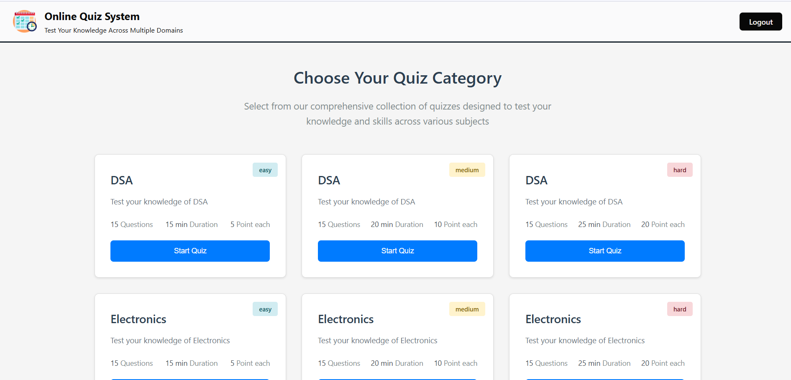

# Online Quiz System

A Django-based **Online Quiz System** that allows users to register, login, and take quizzes across multiple categories with a scoring system. The project supports **easy, medium, and hard** questions, timers, and user score tracking.

---

## Features

- User authentication (signup, login, logout)
- Category-based quizzes
- Multiple-choice questions with 4 options
- Timer functionality for each quiz
- User score calculation and result display
- Admin panel to manage categories, questions, and answers
- Dashboard to view scores

---

## Technologies Used

- Django 4.x
- Python 3.x
- SQLite / PostgreSQL (optional)
- HTML, CSS, JavaScript
- Bootstrap (optional for styling)

---

## Setup Instructions

### 1. Clone the repository

```bash
git clone https://github.com/<username>/<repo>.git
cd <repo>
```

### 2. Create virtual environment
```bash
 python -m venv venv
source venv/bin/activate   # Linux / Mac
venv\Scripts\activate      # Windows
```


### 3. Install dependencies
 ``` pip install -r requirements.txt ```

### 4. Migrate database
``bash
python manage.py makemigrations
python manage.py migrate
```

### 5. Create superuser (for admin)
   ```bash
python manage.py createsuperuser
```

### 6. Load quiz data (fixtures)
 ```bash
python manage.py loaddata fixtures/quizdata.json
```

### 7. Run the server
   ```bash
python manage.py runserver
```

```bash
Visit http://127.0.0.1:8000/ to access the app.
```

### Screenshots
**Home / SignUp**  


**Home / Dashboard**  


**Quiz Selection Page**  


**Quiz Page with Timer**  


**Quiz Submission & Score**  



### Project Structure
```bash
QuizApp/
├── migrations/
├── static/
├── templates/
│   ├── QuizApp/
│   │   ├── QuizQuestion.html
│   │   ├── quizScore.html
│   │   └── ...
├── models.py
├── views.py
├── urls.py
└── ...
```

### Notes

.The fixtures/quizdata.json file contains pre-loaded quiz categories, questions, and answers.

.Timer is configurable per category in the QuizCategory model.

.Users cannot change answers after submission.

.Sensitive information like secret keys should be stored in .env file (do not push to GitHub).


